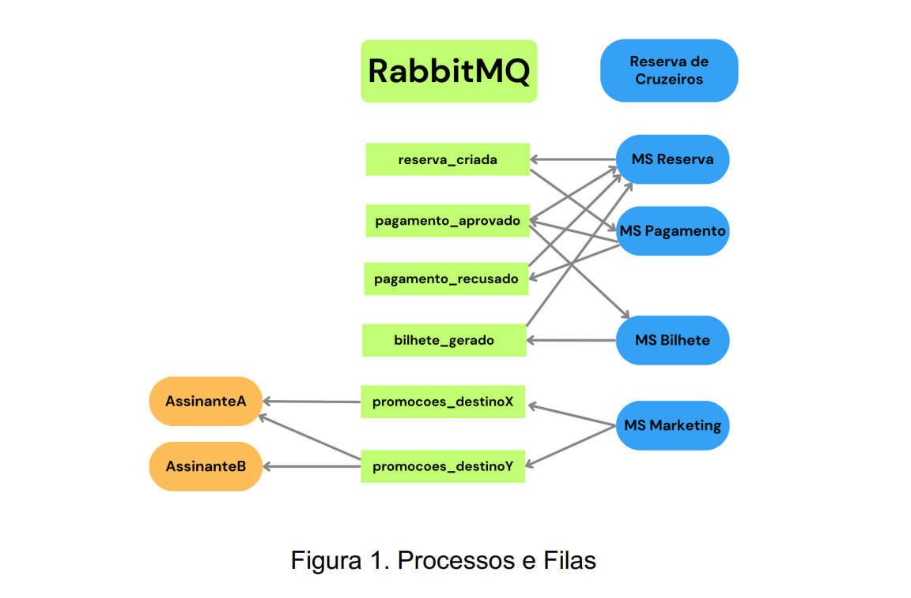

# Cruzeiros-MS-SisDist
Sistemas de Reservas de Cruzeiros, utilizando a arquitetura orientada à eventos e contendo um total de 4 microserviços
Utiliza chave assimétrica (Pagamento Aprovado)
! Necessário ter o rabbitmq instalado !

 
